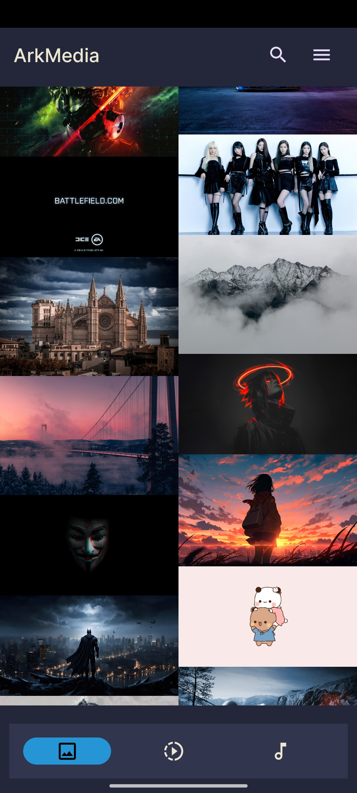
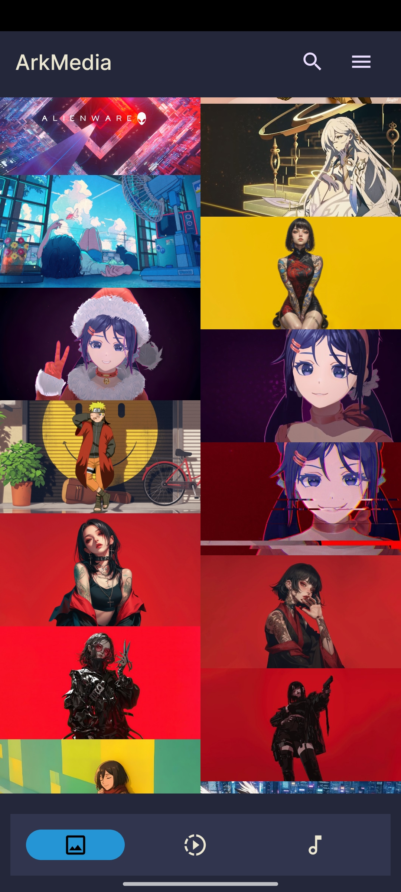
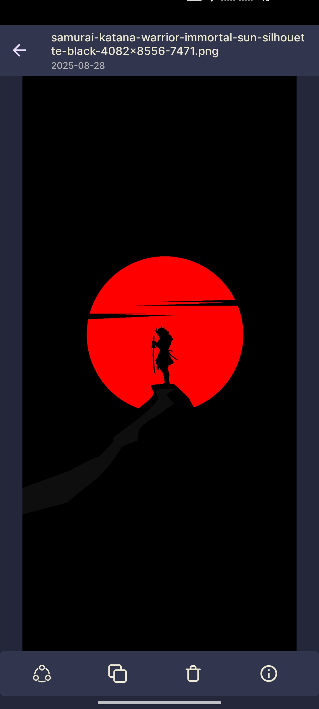
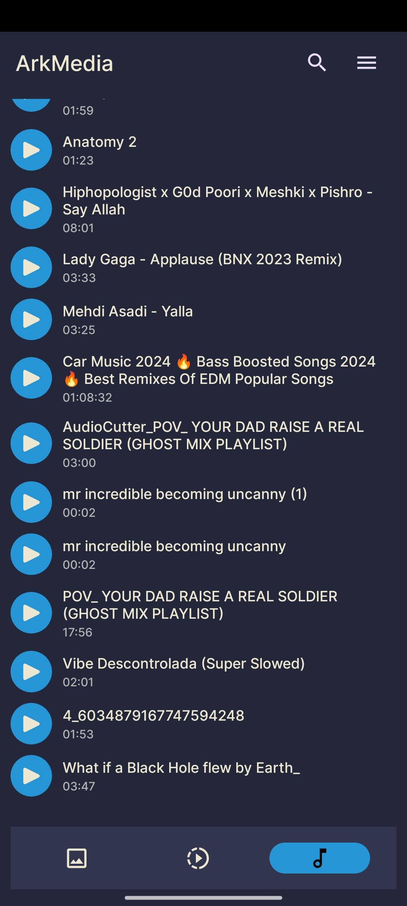
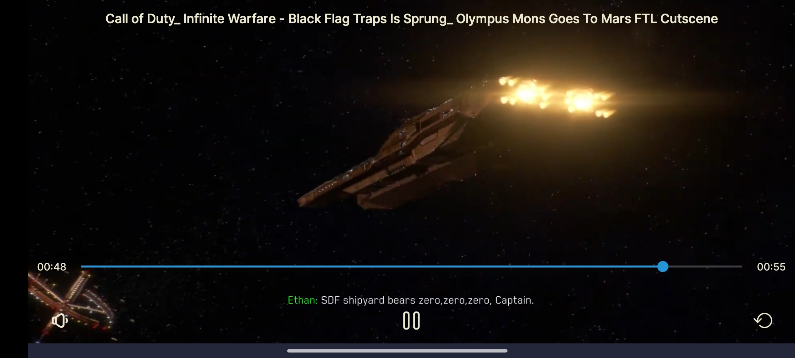
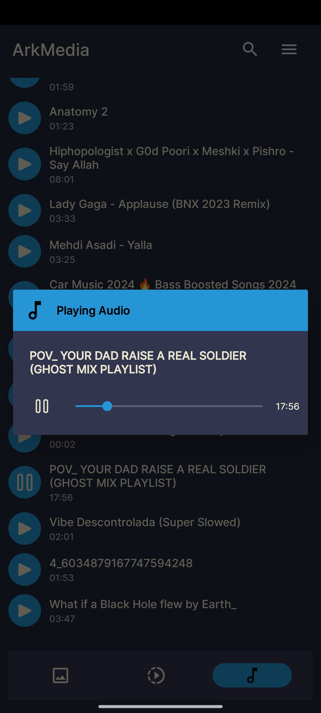

#  😺 ArkMedia ✨

Access your device meida files like images, videos and audios and manage them easily with this application.

## Features

- Access device media files
- Search files
- Play video with custom media controller
- Image viewer for showing images
- Play audio files even in background
- Show files information
- Delete images from device

## Optimizations

The code is well optimized to run any device, but it depends on number of files,
the audio section runs in fastest mode but loading videos make take some time, most of heavy work runs parallel in background threads.

## Installation

Open project in Android Studio and wait until gradle build to finish.
## Demo

## Authors

- [@Mehdi Lavasani](https://github.com/mehdiprgm)

